## {.center}

::: {.center}
**[https://shorturl.at/sTVrH](https://leopold-salzenstein.github.io/eijc26_quarto){style="font-size:1.5em"}**
::: 

# Problem n°1:

<br>

![[Image from "Enough Markdown to Write a Thesis" by Richard J. Telford (2025)]{style="font-size:0.5em"}](images/non_reproducible_workflow.png){fig-align="center"}

## Solution: Quarto

<br><br>

![[Artwork from "Hello, Quarto" keynote by Julia Lowndes and Mine Çetinkaya-Rundel, presented at RStudio::Conf(2022). Illustrated by Allison Horst.]{style="font-size:0.5em"}](images/horst-quarto-schematic.png){fig-align="center"}

## Quarto rendering {.unlisted}

<br><br>

![[Artwork from "Hello, Quarto" keynote by Julia Lowndes and Mine Çetinkaya-Rundel, presented at RStudio::Conf(2022). Illustrated by Allison Horst.]{style="font-size:0.5em"}](images/horst-qmd-render-schema.png){fig-align="center"}

## a simple quarto (.qmd) file

````{.yaml code-line-numbers="|2-3|6|8-12"}
---
title: "A simple yet cool Quarto file"
author: "Leo"
---

## A cool barplot 

`r ''````{r}
cool_data |>
  ggplot(aes(x = cool_variable)) +
  geom_bar()
```
````

**Ingredients of a Quarto file:** 

1. YAML header

2. Markdown language

3. Code chunks (R, Python, SQL, Bash, Julia, etc.)

## YAML header 

<br>

```{.yaml code-line-numbers="|1,10|2-4|5-7|8-9|12"}
---
title: "My Report"              # Metadata
author: Leo
date: "Saturday May 30, 2026"
format:                             # Set format types
  html:                                     
  docx:                            
params:                             # (Optional) Parameter key-value pairs
  year: 2023                                
---
```

<br>

YAML = Yet Another Markdown Language

## A small detour: Markdown 101

:::{.columns}
:::{.column width="40%" .fragment fragment-index=1}
```markdown
# Big Title
## Title
### Sub-title
#### Sub-sub-title
```
:::
:::{.column width="10%" .fragment fragment-index=1}
:::
:::{.column width="50%" .fragment fragment-index=2 style="font-size:0.5em;"}
<h1>Big Title</h1>
<h2>Title</h2>
### Sub-title
#### Sub-sub-title
:::
:::

<br>

:::{.columns}
:::{.column width="40%" .fragment fragment-index=3}
```markdown
normal

**bold**

*italic*

***bold & italic***

~~strikethrough~~

> a quote

`a code chunk`
```
:::
:::{.column width="10%" .fragment fragment-index=3}
:::
:::{.column width="50%" .fragment fragment-index=4 style="font-size:0.7em;"}
normal

**bold**

*italic*

***bold & italic***

~~strikethrough~~

> a quote

`a code chunk`
:::
:::

## Render: Set `format` in YAML header

````{.yaml code-line-numbers="4"}
---
title: "A simple yet cool Quarto file"
author: "Leo"
format: html
---

## A cool barplot 

`r ''````{r}
cool_data |>
  ggplot(aes(y = fct_infreq(cool_things) |> fct_rev())) +
  geom_bar(fill = "violet") +
  labs(
    x = "Scale of cool",
    y = NULL,
    title = "Cool things in this presentation"
  ) +
  theme_minimal() +
  theme(
    panel.grid.major.y = element_blank(),
    panel.grid.minor = element_blank(),
    plot.title = element_text(face = "bold")
  )
```
````

## Render: press the button

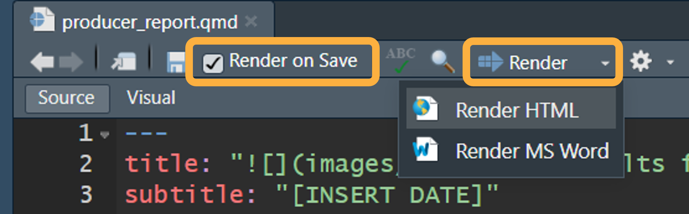{fig-align="center" width="700"}

````{.yaml code-line-numbers=""}
# Python
import quarto
quarto.render()

# R
quarto::quarto_render()
````

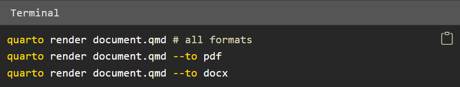{fig-align="center" width="800"}

## a simple quarto (.qmd) file in HTML

````{.yaml code-line-numbers="4"}
---
title: "A simple yet cool Quarto file"
author: "Leo"
format: html
---
````

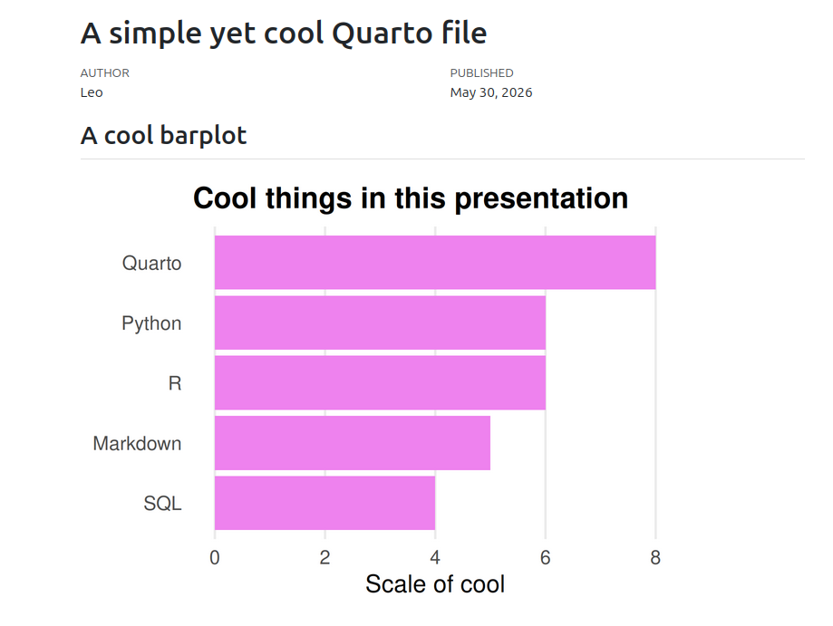{fig-align="center" width="1300"}

## a simple quarto (.qmd) file in PDF

````{.yaml code-line-numbers="4"}
---
title: "A simple yet cool Quarto file"
author: "Leo"
format: pdf
---
````

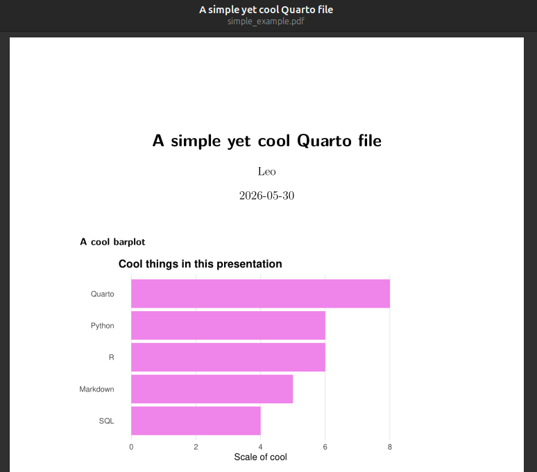{fig-align="center" width="1300"}

## a simple quarto (.qmd) file in DOCX

````{.yaml code-line-numbers="4"}
---
title: "A simple yet cool Quarto file"
author: "Leo"
format: docx
---
````

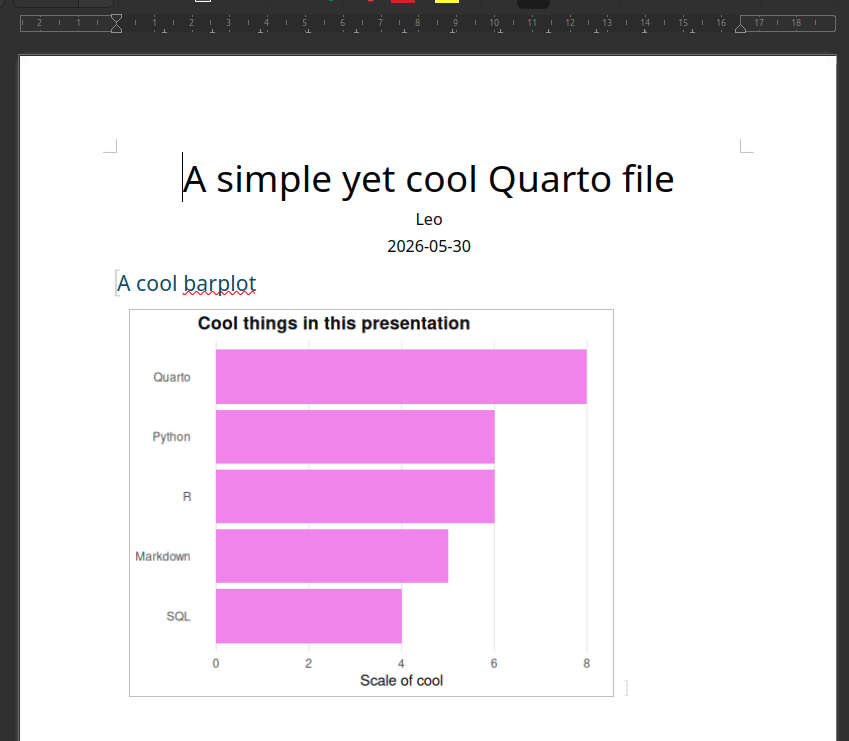{fig-align="center" width="1300"}

## a simple quarto (.qmd) file in EPUB

````{.yaml code-line-numbers="4"}
---
title: "A simple yet cool Quarto file"
author: "Leo"
format: epub
---
````

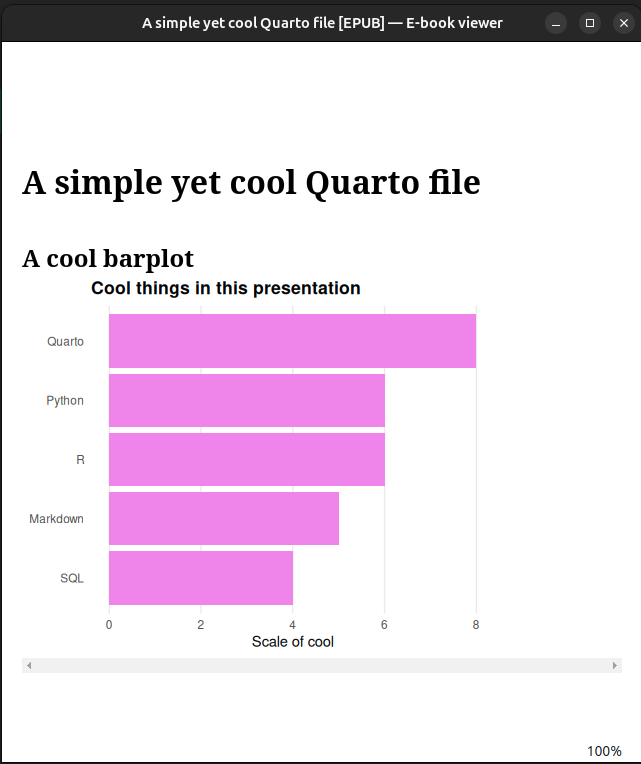{fig-align="center" width="1300"}

## a simple quarto (.qmd) file in (self-contained) HTML

<br>

````{.yaml code-line-numbers="4-6"}
---
title: "A simple yet cool Quarto file"
author: "Leo"
format:
  html:
    embed-resources: true
---
```
````

<br>

Tip: for HTML, set `embed-resources: true` to include all the dependency files (images, etc.) inside the HTML. 

## This presentation is a quarto file (in Reveal.js)

<br>

````{.yaml code-line-numbers="7-10"}
---
title: "One template, many stories"
subtitle: "Parameterized reports with {.quarto-logo}"
author: "Leopold Salzenstein"
date: "Saturday May 30, 2026"
engine: knitr
format:
  revealjs: 
    theme: [solarized, custom.scss]
    include-after-body: header-links.html
---
````

## Where we are now

<br>

![[Image from "Enough Markdown to Write a Thesis" by Richard J. Telford (2025)]{style="font-size:0.5em"}](images/reproducible_workflow.png){fig-align="center"}

## Mid-presentation conclusion: Quarto is cool 

:::{.r-stack}
![[Artwork from "Hello, Quarto" keynote by Julia Lowndes and Mine Çetinkaya-Rundel, presented at RStudio Conference 2022. Illustrated by Allison Horst.]{style="font-size:0.5em"}](images/quarto_is_cool.jpeg){fig-align="center"}
:::

# Problem n°2:

<br>

![[Image from the "R Productive Workflow" by Yan Holtz]{style="font-size:0.5em"}](images/repetitive_workflow.png){fig-align="center"}

## Solution: Parameterized reports in Quarto

##

:::{.r-stack}
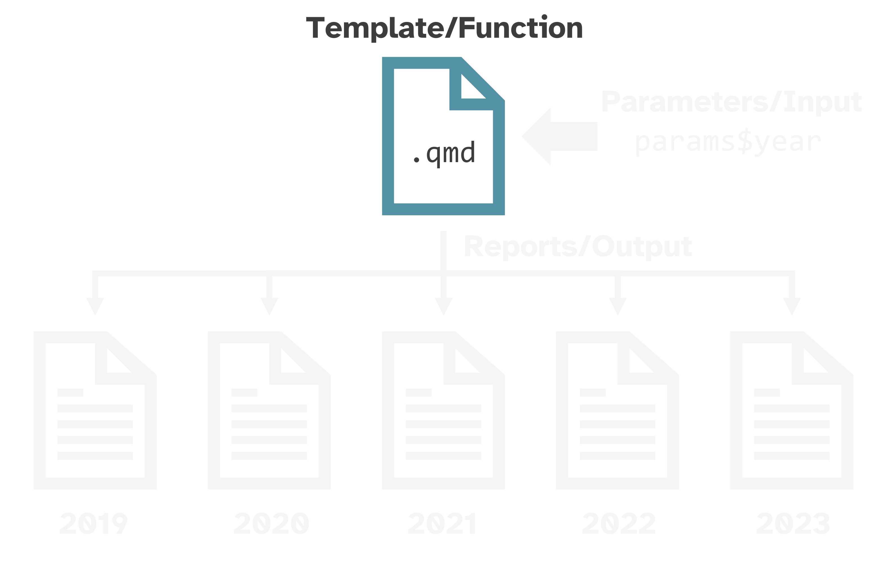{.fragment width="1300" fig-align="left" style="margin-top:-1em"}

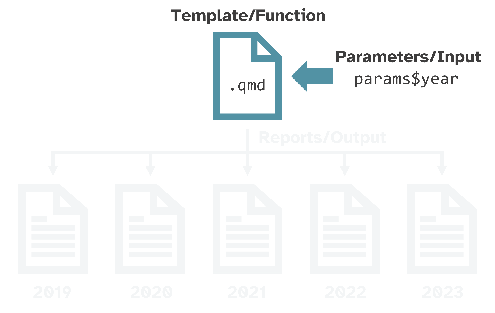{.fragment width="1300" fig-align="left" style="margin-top:-1em"}

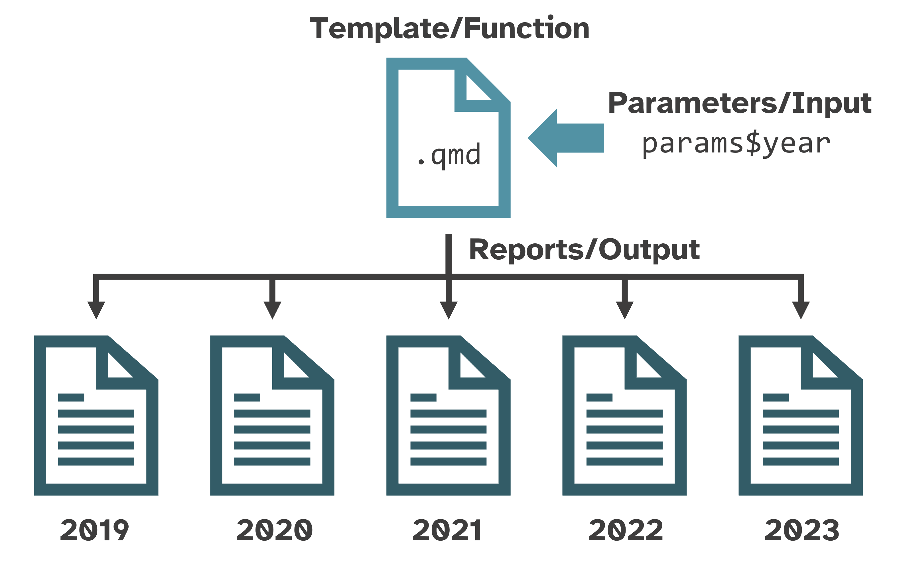{.fragment width="1300" fig-align="left" style="margin-top:-1em"}
:::

## What makes a report "paramaterized"?

<br>

1. YAML header with `params` key-value pairs

2. Use those `params` in your report to create different variations

<br>

... by geography, by date, by audience type, etc.  

## Example: Nitrogen oxides (NOX) emissions

<br>

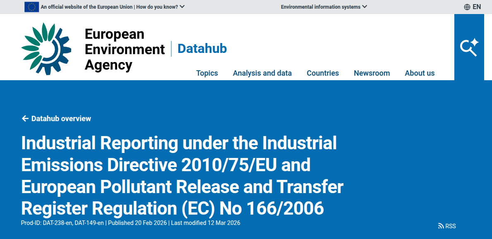{fig-align="center"}

<br>

.. in Belgium and its neighbours (NL, DE, FR, LU)

## Step 1: make template analysis

<br>

`````{.yaml code-line-numbers="|1,5"}
## Top 10 facilities emitting NOX in Belgium in 2023

`r ''````{r}
nox_emissions |>
  filter(country == Belgium) |>
  summarise(total_emissions = sum(total_emissions, na.rm = TRUE),
            .by = c(facility, city)) |>
  slice_max(total_emissions, n = 10) |>
  mutate(facility_label = str_glue("{facility} ({city})")) |>
  ggplot(aes(
    x = fct_reorder(facility_label, total_emissions),
    y = total_emissions
  )) +
  geom_col(fill = "darkgreen") +
  coord_flip() +
  labs(
    x = NULL,
    y = "NOX emissions (kg)",
    title = "Top NOX emitting facilities"
  ) +
  theme_minimal() +
  theme(
    panel.grid.major.y = element_blank(),
    panel.grid.minor = element_blank(),
    plot.title = element_text(face = "bold")
  )
````
`````

## Step 1: make template analysis

<br>

`````{.yaml code-line-numbers="1,5"}
## Top 10 facilities emitting NOX in ``r ''`r params$country` in 2023

`r ''````{r}
nox_emissions |>
  filter(country == params$country) |>
  summarise(total_emissions = sum(total_emissions, na.rm = TRUE),
            .by = c(facility, city)) |>
  slice_max(total_emissions, n = 10) |>
  mutate(facility_label = str_glue("{facility} ({city})")) |>
  ggplot(aes(
    x = fct_reorder(facility_label, total_emissions),
    y = total_emissions
  )) +
  geom_col(fill = "darkgreen") +
  coord_flip() +
  labs(
    x = NULL,
    y = "NOX emissions (kg)",
    title = "Top NOX emitting facilities"
  ) +
  theme_minimal() +
  theme(
    panel.grid.major.y = element_blank(),
    panel.grid.minor = element_blank(),
    plot.title = element_text(face = "bold")
  )
````
`````
## Step 1: make template analysis

`````{.yaml code-line-numbers=""}
`r ''````{r}
top_facility <- nox_emissions |>
  filter(country == params$country) |>
  arrange(desc(total_emissions)) |>
  head(1) |>
  select(facility, city, total_emissions)
````
`````

<br>

For inline code, enclose the expression in `` `r ` `` / `` `python ` ``.

`````{.yaml code-line-numbers=""}
``r ''`r top_facility$facility` is the facility that emitted most NOX in 
``r ''`r params$country` in 2023. 

It is located in ``r ''`r top_facility$city`. 

In 2023, it emitted approximately 
``r ''`r format(round(top_facility$total_emissions), big.mark=" ")` 
kg of NOX in the atmosphere.
`````

## Step 2: Set `params` in YAML header

<br>

```{.yaml code-line-numbers="2|3-5|6-7|10|"}
---
title: "Report: NOX emissions in ``r ''`r params$country` (2023)"
format:
  html:
    embed-resources: true
params:
  country: "Belgium"
---

Report content goes here.
```

## Step 3: render (one report)

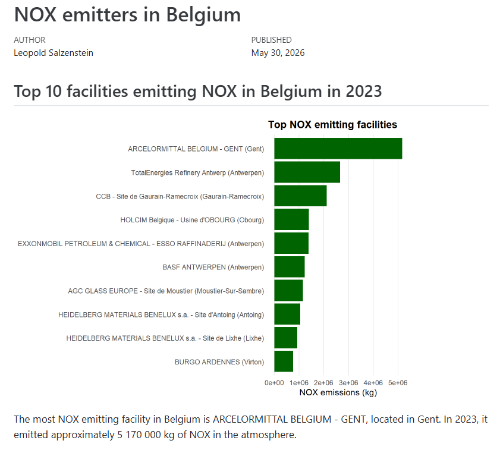{fig-align="center" width="1000"}

Tip: also render some outliers (e.g. countries with little data) to check them. 

## Step 3: render (several reports)

<br>

In a separate file (ex. render_country_files.R):

<br>

```{.yaml code-line-numbers="|1|3|5"}
countries_to_analyze <- c("Belgium", "France", "Germany", "Luxembourg", "Netherlands")

template_file <- "path/to/country_template.qmd"

output_dir <- "path/to/Results"
```


## Step 3: render (several reports)

<br>

```{.yaml code-line-numbers="1|3|5-8|11|14|"}
  render_country <- function(country_name) {
  
  filename <- str_glue("RESULTS_{str_replace_all(country_name, ' ', '_')}.html")
  
  quarto::quarto_render(
    input = template_file,
    execute_params = list(country = country_name),
    output_file = filename
  )
  
  file.rename(from = filename, to = file.path(output_dir, filename))
}

walk(countries_to_analyze, render_country)
```


## Step 3: render (several reports)

<br>

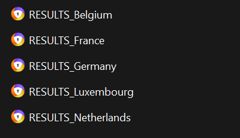{fig-align="left" width="400"}

## Step 3: render (several reports)

<br>

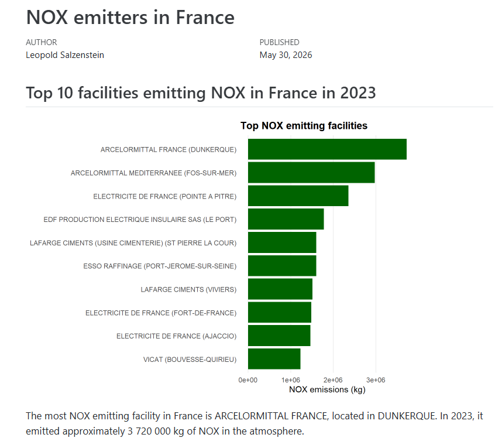{fig-align="center" width="1300"}

## Step 3: render (several reports)

<br>

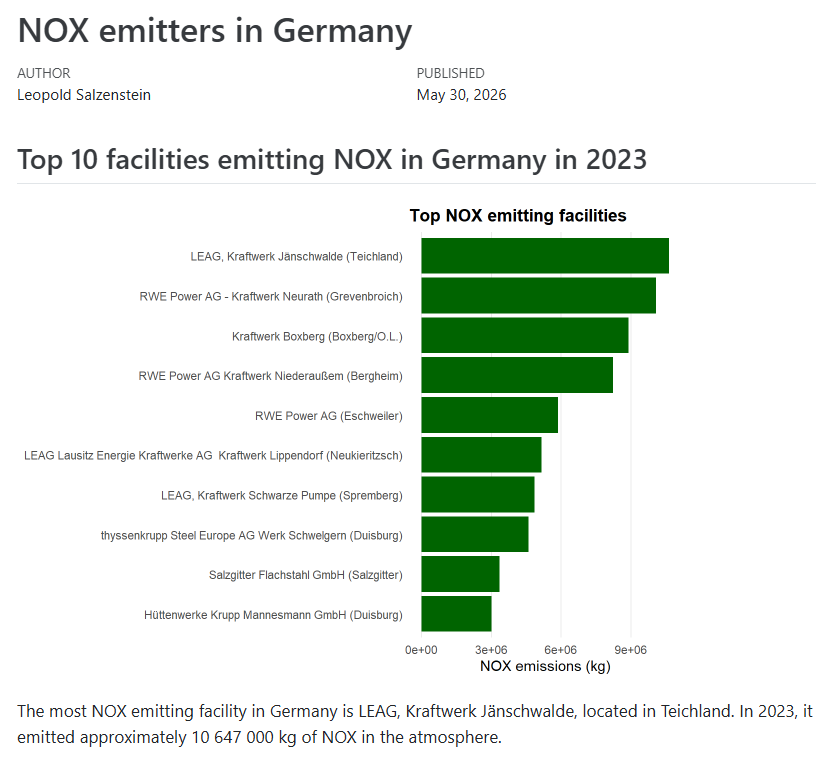{fig-align="center" width="1300"}

## Step 3: render (several reports)

<br>

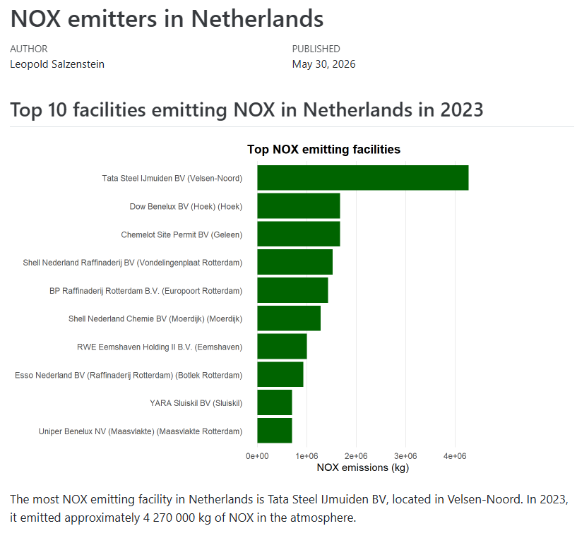{fig-align="center" width="1300"}

## Bonus #1: render with multiple `params`

<br>

```{.yaml code-line-numbers="2,6,7"}
---
title: "Report: NOX emissions in ``r ''`r params$country` (2023)"
format:
  html:
    embed-resources: true
params:
  country: "Belgium"
---

Report content goes here.
```

## Bonus #1: render with multiple `params`

<br>

```{.yaml code-line-numbers="2,3,5,6,7"}
---
title: "Report: ``r ''`r params$pollutant` emissions 
in ``r ''`r params$country` (2023)"
format: html
params:
  country: "Belgium"
  pollutant: "NOX"
---

Report content goes here.
```

## Bonus #1: render with multiple `params`

<br>

```{.yaml code-line-numbers="2,3,5,6,7,8"}
---
title: "Report: ``r ''`r params$pollutant` emissions 
in ``r ''`r params$country` (``r ''`r params$year`)"
format: html
params:
  country: "Belgium"
  pollutant: "NOX"
  year: "2023"
---

Report content goes here.
```

## Bonus #1: render with multiple `params`

<br>

```{.yaml code-line-numbers="1-3|6-14|16"}
params_grid <- tibble(
  country   = c("Belgium",  "France", "Germany"),
  pollutant = c("PM2.5",    "NOX",    "CO2")
)

render_report <- function(country_name, pollutant_name) {
  filename <- str_glue("RESULTS_{str_replace_all(country_name, ' ', '_')}_{pollutant_name}_2023.html")
  quarto::quarto_render(
    input = template_file,
    execute_params = list(country = country_name, pollutant = pollutant_name),
    output_file = filename
  )
  file.rename(from = filename, to = file.path(output_dir, filename))
}

pwalk(params_grid, render_report)
```

## Bonus #2: render for tech vs non-tech audience

<br>

````{.yaml code-line-numbers="3-4|9-14"}
---
title: "My report"
params:
  audience: "tech"
---

`r ''````{r}
#| include: false

is_tech <- ``r ''`r params$audience` == "tech"
knitr::opts_chunk$set(
  echo    = is_tech,
  warning = is_tech,
  message = is_tech
)
```
````

## Bonus #2: render for tech vs non-tech audience

:::: {.columns}

::: {.column width="40%"}
```{.yaml code-line-numbers="3-4"}
---
title: "My report"
params:
  audience: "non-tech"
---
```

:::

::: {.column width="60%"}
{fig-align="center"}
:::

::::

## Bonus #2: render for tech vs non-tech audience

:::: {.columns}

::: {.column width="40%"}
```{.yaml code-line-numbers="3-4"}
---
title: "My report"
params:
  audience: "tech"
---
```

:::

::: {.column width="60%"}
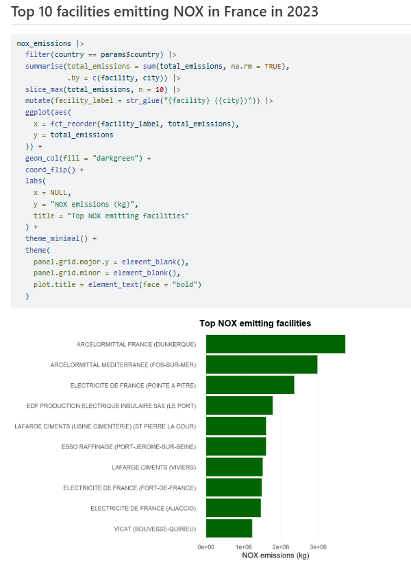{fig-align="center"}
:::

::::

## Where we are now

<br>

![[Image from the "R Productive Workflow" by Yan Holtz]{style="font-size:0.5em"}](images/non_repetitive_workflow.png){fig-align="center"}

## Use cases

<br>

::: {layout-ncol=2}
{fig-align="center" width="600"}

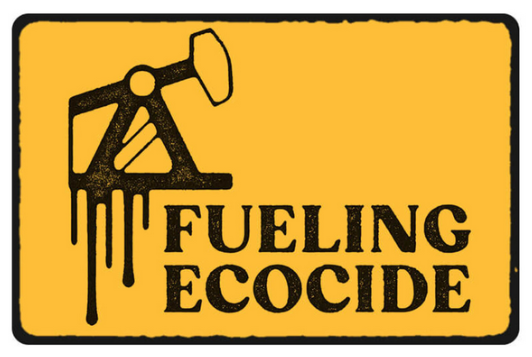{fig-align="center" width="600"}
:::

## Questions? 

:::{.r-stack}
![[Artwork from "Hello, Quarto" keynote by Julia Lowndes and Mine Çetinkaya-Rundel, presented at RStudio Conference 2022. Illustrated by Allison Horst.]{style="font-size:0.5em"}](images/quarto_end.jpeg){fig-align="center" width="800"}
:::

:::{.r-stack}
[[leo@journalismarena.eu](leo@journalismarena.eu)  /  [https://github.com/leopold-salzenstein/eijc26_quarto](https://github.com/leopold-salzenstein/eijc26_quarto)]{style="font-size:0.7em"}
:::